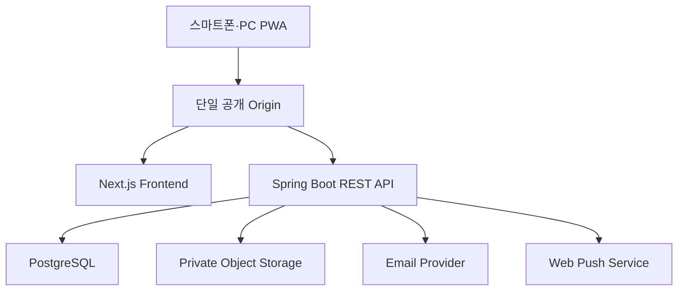
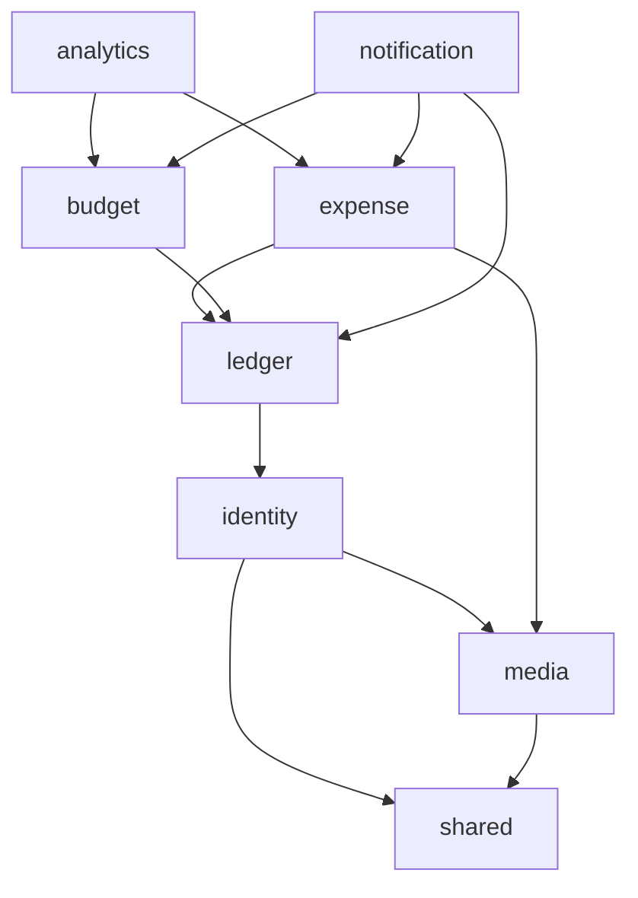
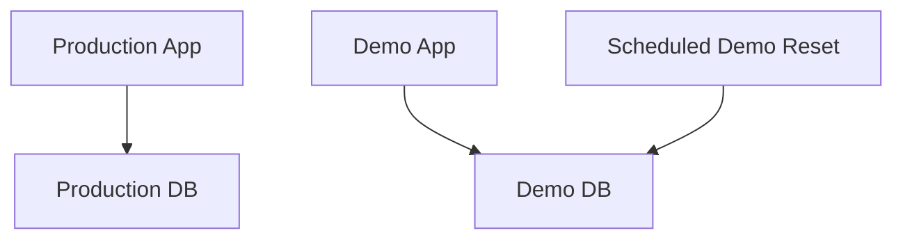

# MealBudgetDiet 시스템 아키텍처

- 문서 버전: 1.3
- 기준 요구사항: [requirements.md](requirements.md)
- 아키텍처 유형: 모듈형 모놀리스
- 대상 플랫폼: 모바일 우선 PWA

## 1. 설계 원칙

1. 실제 사용자가 매일 쓰기 쉬운 구성을 우선한다.
2. 여러 독립 장부를 지원하되 장부 하나당 1~5명의 사용자를 기준으로 단순하게 설계한다.
3. 인증, 권한, 데이터 정합성처럼 포트폴리오에서 설명 가치가 높은 부분은 실제 운영 수준으로 구현한다.
4. 측정된 문제가 없는 Redis, Kafka, Airflow, 별도 통계 서버와 마이크로서비스는 도입하지 않는다.
5. 프론트엔드와 API를 분리하되 브라우저에는 하나의 출처(origin)로 제공한다.
6. 실제 환경과 데모 환경은 애플리케이션과 데이터 경계에서 분리한다.

## 2. 기술 스택

| 영역 | 기술 | 사용 목적 |
|---|---|---|
| Language | Java 21 | 백엔드 애플리케이션 |
| Backend | Spring Boot 4.1.x | REST API와 애플리케이션 실행 |
| Security | Spring Security, Spring Session JDBC | 인증, 인가, 명시적 폐기형 영속 세션 |
| Persistence | Spring Data JPA | 트랜잭션 기반 CRUD |
| Analytics SQL | Spring JdbcClient | 집계와 통계 SQL 명시적 구현 |
| Migration | Flyway | DB 스키마 버전 관리 |
| Database | PostgreSQL 18 | 원본 데이터와 집계 조회 |
| Image storage | S3 호환 비공개 Object Storage | 식비·프로필 이미지 원본 수신과 변환본 저장 |
| Frontend | Next.js 16, React, TypeScript | 반응형 PWA |
| UI | Tailwind CSS, shadcn/ui | 모바일 우선 UI |
| Server state | TanStack Query | 조회 캐시와 변경 후 무효화 |
| Form | React Hook Form, Zod | 입력 상태와 클라이언트 검증 |
| Chart | Recharts | 일별 추이와 카테고리 통계 |
| Push | Web Push, Service Worker, VAPID | 조건부 예산 알림 |
| Backend test | JUnit 5, Testcontainers, REST Assured | 단위·통합·API 테스트 |
| Frontend test | Vitest, Playwright | 컴포넌트·E2E 테스트 |
| Local environment | Docker Compose | PostgreSQL과 로컬 실행 환경 |
| CI | GitHub Actions | 빌드, 테스트, 정적 검사 |
| Observability | Actuator, Micrometer, structured log | 상태 점검과 운영 관찰 |

버전은 구현 시작 시 lock file과 빌드 파일에 정확히 고정한다.

## 3. 전체 구성



### 3.1 단일 Origin

브라우저에서는 다음과 같이 하나의 도메인만 사용한다.

- 화면: `https://service.example.com/*`
- API: `https://service.example.com/api/v1/*`

배포 계층 또는 Next.js rewrite가 `/api/*` 요청을 Spring Boot로 전달한다. 이 방식으로 다음 문제를 줄인다.

- 교차 출처 CORS 설정
- 타사 쿠키 제한
- 세션 쿠키의 도메인 불일치
- 개발·운영 환경별 API 주소 노출

프론트엔드는 데이터베이스에 직접 접근하지 않는다.

## 4. 백엔드 구조

### 4.1 모듈형 모놀리스

하나의 Spring Boot 애플리케이션 안에서 도메인 경계를 패키지로 분리한다.

```text
com.mealbudgetdiet
├── identity       # 사용자, 로그인, 세션, 비밀번호 재설정
├── ledger         # 공용 장부, 참여자, 관리자, 초대
├── expense        # 식비와 카테고리
├── media          # 이미지 검증, 변환, 임시·영구 저장
├── budget         # 기본·월별 예산
├── analytics      # 대시보드, 통계, CSV
├── notification   # 푸시 구독, 예산 알림 판정과 발송
└── shared         # 공통 예외, 시간, API 응답, 보안 컨텍스트
```

### 4.2 모듈 의존 방향



- 다른 모듈의 JPA Repository를 직접 호출하지 않는다.
- 모듈 간 접근은 공개 Application Service 또는 조회 Port를 사용한다.
- 순환 의존성을 허용하지 않는다.
- Controller는 도메인 규칙을 구현하지 않고 요청 변환과 응답 생성만 담당한다.

### 4.3 계층 구조

각 기능 모듈은 다음 구조를 기본으로 한다.

```text
module
├── api             # REST Controller, request/response DTO
├── application     # use case, transaction boundary
├── domain          # entity, value object, domain policy
└── infrastructure  # JPA, SQL, email 등 외부 연동
```

작은 기능은 불필요하게 파일을 분리하지 않되 의존 방향은 유지한다.

## 5. 인증과 세션

### 5.1 인증 방식

JWT를 브라우저 저장소에 보관하지 않고 서버 세션 방식을 사용한다.

- Spring Security로 이메일·비밀번호 인증
- Spring Session JDBC로 세션을 PostgreSQL에 저장
- 브라우저에는 임의 세션 ID만 Secure, HttpOnly 쿠키로 전달
- 애플리케이션은 세션에 고정 만료나 미사용 만료 시간을 적용하지 않음
- 브라우저가 허용하는 장기 지속 쿠키를 사용하고 인증 요청 시 쿠키 만료 시점을 갱신
- 로그아웃 시 현재 서버 세션과 쿠키를 함께 무효화
- 비밀번호 변경·재설정 또는 회원 탈퇴 시 해당 사용자의 모든 서버 세션을 무효화
- 상태 변경 요청에는 CSRF 보호 적용

브라우저 데이터 삭제, 시크릿 모드 종료, 브라우저의 쿠키 보존 상한으로 쿠키가 제거될 수는 있다. 이 경우 다시 로그인해야 하지만 애플리케이션 자체 시간 제한으로 세션을 종료하지는 않는다.

세션 쿠키 예시:

```text
Name: MBD_SESSION
HttpOnly: true
Secure: true (production)
SameSite: Lax
Path: /
Max-Age: 2147483647초, 인증 요청마다 갱신
```

### 5.2 비밀번호

- 비밀번호는 BCrypt 또는 Spring Security가 권장하는 DelegatingPasswordEncoder로 해시한다.
- 원문 비밀번호를 로그나 DB에 저장하지 않는다.
- 로그인 실패 응답으로 이메일 존재 여부를 노출하지 않는다.
- 반복 로그인 실패와 비밀번호 재설정 요청에 rate limit을 적용한다.
- rate limit 카운터는 PostgreSQL 고정 윈도우와 원자적 upsert로 갱신해 다중 서버에서도 일관되게 동작한다.
- 카운터 키와 보안 로그에는 이메일·클라이언트 주소 원문이 아닌 환경별 HMAC-SHA-256 식별자를 사용한다.
- 로그인 제한은 HTTP 429와 `Retry-After`로 알리고, 재설정 요청 제한은 계정 열거를 막기 위해 HTTP 202로 숨긴다.

### 5.3 비밀번호 재설정

- 256비트 이상의 난수 토큰을 발급한다.
- DB에는 토큰 원문이 아닌 SHA-256 해시만 저장한다.
- 링크 유효기간 기본값은 30분이다.
- 성공적으로 사용하거나 새 토큰이 발급되면 기존 토큰을 무효화한다.
- 재설정 완료 후 기존 로그인 세션을 모두 종료한다.

### 5.4 최초 서비스 관리자 생성

빈 운영 환경에서는 환경 변수로 주입한 일회용 bootstrap token을 이용해 최초 서비스 관리자 한 명을 생성하고, 이 계정이 사용할 첫 장부와 장부 관리자 멤버십도 함께 만든다.

- 활성 서비스 관리자가 없는 경우에만 bootstrap API 활성화
- 생성 성공 후 같은 토큰 재사용 불가
- bootstrap token은 GitHub에 저장하지 않음
- 데모 환경은 별도의 seed 작업으로 데모 관리자를 생성

## 6. 권한 모델

권한은 두 축으로 분리한다.

- 서비스 역할: `SERVICE_ADMIN`, `USER`
- 장부 역할: `ADMIN`, `MEMBER`

서비스 관리자도 자신의 장부에서는 별도의 장부 역할을 가지며, 일반 사용자는 장부 생성 시 자동으로 `ADMIN`이 된다. 아래 표는 장부 역할 권한이다.

| 기능 | MEMBER | ADMIN |
|---|:---:|:---:|
| 식비 조회·등록·수정·삭제 | O | O |
| 대시보드·통계·CSV | O | O |
| 초대 코드 발급·조회·취소 | O | O |
| 본인 탈퇴 | O | O |
| 본인 프로필 사진 등록·교체·삭제 | O | O |
| 기본·월별 예산 변경 | X | O |
| 월 예산 시작일 변경 | X | O |
| Push 기준 사용률 변경 | X | O |
| 카테고리 추가·수정·삭제 | X | O |
| 관리자 지정·해제 | X | O |

권한은 화면 숨김만으로 처리하지 않고 모든 API에서 서버가 다시 검사한다.

마지막 관리자는 다음 조건을 충족해야 탈퇴할 수 있다.

1. 현재 비밀번호 재확인
2. 삭제 대상과 결과 안내
3. 명시적인 확인 문자열 입력
4. 하나의 트랜잭션에서 장부 관련 데이터 삭제

## 7. 데이터 저장 전략

### 7.1 식별자와 시간

- 도메인 엔티티 ID는 UUID를 사용한다.
- 식비 사용일은 PostgreSQL `date`로 저장한다.
- 생성·수정 시각은 `timestamptz`로 저장한다.
- 월별 예산의 `budget_month`는 예산 주기가 시작되는 날짜가 속한 연·월의 1일을 저장한다.
- 예산 주기는 장부의 시작일과 Asia/Seoul 날짜를 기준으로 계산한다.
- 설정일이 없는 달에는 해당 월의 마지막 날을 주기 시작일로 사용한다.

### 7.2 금액

- 금액은 PostgreSQL `bigint`에 원 단위 정수로 저장한다.
- 식비와 예산은 0보다 큰 값만 허용한다.
- 부동소수점 타입을 사용하지 않는다.

### 7.3 트랜잭션

- 하나의 사용자 명령은 하나의 application service 트랜잭션으로 처리한다.
- 통계 조회는 read-only 트랜잭션을 사용한다.
- 장부 종료는 관련 데이터가 일부만 삭제되지 않도록 하나의 원자적 작업으로 처리한다.

### 7.4 동시 수정

식비와 관리 설정에 정수형 `version` 컬럼을 둔다.

- 조회 응답에 version 포함
- 수정·삭제 요청에 조회한 version 포함
- version이 다르면 HTTP 409 Conflict 반환
- 클라이언트는 최신 데이터를 다시 보여주고 재시도 여부를 묻는다

### 7.5 조회와 통계

- CRUD는 Spring Data JPA를 사용한다.
- 일별 합계, 카테고리 비중, 비교 통계는 JdbcClient의 명시적 PostgreSQL SQL로 구현한다.
- 목록 ‘더 보기’는 offset 대신 커서 기반 페이지 조회를 사용한다.
- 커서는 `spent_on + created_at + id` 조합을 인코딩한다.
- 초기에는 원본 식비 테이블을 직접 집계한다.
- 실제 측정 결과가 필요하기 전에는 캐시, 요약 테이블, materialized view를 추가하지 않는다.

### 7.6 이미지 저장

- 업로드 원본은 JPEG, PNG, WebP만 허용하고 파일당 최대 5MB로 제한한다.
- 서버는 스트리밍 수신 중 크기를 제한하고 magic bytes와 실제 디코딩 성공 여부를 모두 검증한다.
- EXIF 등 메타데이터를 제거하고 표시 크기로 리사이징한 WebP 변환본만 비공개 Object Storage에 저장한다.
- DB에는 저장 키, 크기, 가로·세로, 상태, 업로더 같은 메타데이터만 저장한다.
- 업로드 직후 이미지는 `TEMP` 상태이며 식비 또는 프로필에 연결되는 트랜잭션에서 `ACTIVE`로 전환한다.
- 소유자가 취소한 임시 이미지와 보존 시간이 지난 `TEMP`, 더 이상 참조되지 않는 `ACTIVE` 이미지는 정리 작업으로 삭제한다.
- 이미지 조회는 장부 참여자 또는 본인 권한을 확인한 애플리케이션 경유 요청으로만 제공한다.

## 8. 프론트엔드 구조

### 8.1 주요 라우트

| 경로 | 화면 |
|---|---|
| `/login` | 로그인 |
| `/signup` | 새 장부와 장부 관리자 계정 만들기 |
| `/setup` | 최초 서비스 관리자와 첫 장부 만들기 |
| `/join?code=...` | 초대 코드 기반 회원가입 |
| `/forgot-password` | 비밀번호 재설정 요청 |
| `/reset-password` | 새 비밀번호 설정 |
| `/privacy` | 공개 개인정보처리방침 |
| `/account-deletion` | 공개 계정 삭제 안내, 로그인 후 웹 삭제 경로 |
| `/` | 현재 예산 주기 대시보드 |
| `/expenses` | 식비 목록, 검색, 수정·삭제 |
| `/statistics` | 기간별 통계 |
| `/settings` | 설정 메인과 하위 메뉴 진입 |
| `/settings/budget` | 예산과 월 예산 시작일 관리 |
| `/settings/notifications` | 기기별 Web Push 수신과 장부 Push 기준 사용률 설정 |
| `/settings/categories` | 카테고리 관리 |
| `/settings/members` | 참여자와 관리자 관리 |
| `/settings/invitations` | 초대 코드 관리 |
| `/settings/account` | 프로필 사진, 비밀번호 변경, 로그아웃, 탈퇴 |
| `/offline` | 연결 필요 안내 |

`/privacy`와 `/account-deletion`은 세션 없이 접근할 수 있다. Google Play의 외부 계정 삭제 URL에는 `/account-deletion`을 등록하고, 사용자는 앱을 다시 설치하지 않아도 브라우저에서 로그인한 뒤 `/settings/account`의 삭제 절차를 완료할 수 있다.

### 8.2 상태 관리

- 서버 데이터는 TanStack Query로 조회하고 변경 후 관련 query key를 무효화한다.
- 등록 성공 후 dashboard, recent expenses, statistics 데이터를 갱신한다.
- 폼 입력 상태는 React Hook Form으로 관리하고 Zod로 1차 검증한다.
- 서버 검증을 최종 기준으로 사용한다.
- 전역 클라이언트 상태는 꼭 필요한 UI 상태만 유지한다.

### 8.3 PWA

- Web App Manifest와 서비스 워커를 제공한다.
- 앱 shell과 offline 안내 화면만 캐시한다.
- 인증 API와 식비 데이터 응답은 오프라인 저장 대상으로 삼지 않는다.
- 네트워크 연결이 없으면 쓰기 작업을 큐에 넣지 않고 즉시 안내한다.
- 사용자가 명시적으로 허용한 기기만 Web Push 구독을 등록한다.
- 알림 권한을 거부해도 식비 관리 기능은 정상적으로 사용할 수 있다.
- 192px, 512px, maskable 및 monochrome PNG 아이콘을 manifest에 제공한다.

### 8.4 Android TWA

- 화면 표시명은 `Sikbi - 함께 쓰는 식비 관리`, Android 런처 이름은 `Sikbi`, 패키지 ID는 `app.sikbi`로 고정한다.
- 운영 HTTPS origin과 Android 서명 인증서는 Digital Asset Links로 검증한다.
- Play 제출 빌드는 Android 16(API 36) 이상을 대상으로 한다.
- Android wrapper는 Bubblewrap으로 생성하고 Android Browser Helper 및 Bubblewrap 갱신 시 내부 테스트 트랙에서 회귀 검증한다.

### 8.4 월 예산 초과 위험 푸시

식비 신규 등록 트랜잭션이 성공하면 등록일이 현재 예산 주기에 속하는 경우에만 예산 알림 조건을 평가한다.

```text
budgetUsageRate >= pushUsageThreshold
AND
totalSpent / elapsedDays * daysInCycle > cycleBudget
```

정수 나눗셈과 반올림 오차를 피하기 위해 실제 비교는 교차 곱셈으로 수행한다.

```text
totalSpent * 100 >= cycleBudget * pushUsageThreshold
AND
totalSpent * daysInCycle > cycleBudget * elapsedDays
```

처리 흐름:

1. 식비 저장과 동일한 트랜잭션에서 현재 예산 주기 합계, 적용 예산, 장부의 Push 기준 사용률을 조회한다.
2. 등록 시점의 Asia/Seoul 날짜를 기준으로 주기 시작일부터 오늘까지의 경과일수와 예상 주기 종료 지출을 계산한다.
3. 두 조건을 모두 만족하면 예산 주기별 알림 이벤트 생성을 시도한다.
4. `unique (ledger_id, cycle_month, alert_type)` 제약조건으로 예산 주기당 1회만 생성한다.
5. 트랜잭션 커밋 후 비동기 dispatcher가 활성 push subscription에 발송한다.
6. 실패한 전송은 제한된 횟수만 재시도하고 만료 endpoint는 비활성화한다.

외부 메시지 브로커는 사용하지 않는다. PostgreSQL에 알림 이벤트와 기기별 전송 상태를 저장하는 작은 transactional outbox 방식으로 유실과 중복을 제어한다. 푸시 payload에는 고유 notification ID를 포함하고 서비스 워커는 같은 ID의 중복 표시를 방지한다.

Web Push 암호화와 VAPID 서명은 `webpush-java` 어댑터 안으로 격리한다. HTTP 전송은 Java 21 기본 `HttpClient`를 재사용하며 연결·요청 timeout과 redirect 금지를 적용한다. Maven Central의 5.1.2 배포본에서 발생하는 VAPID `Crypto-Key` Base64 padding 문제는 어댑터에서만 보정하고 회귀 테스트로 보호한다. 새 공식 배포본으로 올릴 때는 해당 보정의 필요 여부, AES128GCM 헤더, Chrome·Firefox 실제 기기 전송을 확인한 뒤 제거한다.

## 9. API 설계 원칙

- 기본 경로: `/api/v1`
- JSON 필드: camelCase
- 날짜: `YYYY-MM-DD`
- 월: `YYYY-MM`
- 시각: ISO 8601 UTC offset 포함
- 금액: JSON number의 정수
- 성공 응답은 리소스 또는 명시적 결과 DTO 반환
- 오류 응답은 `application/problem+json` 사용
- 목록은 커서 기반 페이지 응답 사용
- 생성 요청은 중복 전송에 대비해 필요 시 idempotency key 적용

오류 응답 예시:

```json
{
  "type": "https://sikbi.app/problems/version-conflict",
  "title": "Expense was changed",
  "status": 409,
  "code": "EXPENSE_VERSION_CONFLICT",
  "detail": "다른 사용자가 이 식비 내역을 먼저 변경했습니다.",
  "traceId": "..."
}
```

## 10. 실제 환경과 데모 환경



- production과 demo는 서로 다른 애플리케이션 환경을 사용한다.
- 최소한 서로 다른 PostgreSQL database와 DB 계정을 사용한다.
- demo 애플리케이션에서 production 연결 정보에 접근할 수 없다.
- demo 데이터 초기화 작업은 demo DB에만 권한을 가진다.
- 데모 비밀번호와 데이터는 실제 개인정보를 사용하지 않는다.
- 단순 `is_demo` 컬럼으로 실제 데이터와 데모 데이터를 같은 테이블에 섞지 않는다.

## 11. 로컬 개발 환경

초기 Docker Compose 구성:

```text
postgres
object-storage
backend
frontend
```

로컬 Object Storage는 S3 API 호환 MinIO를 사용한다. 개발 속도를 위해 backend와 frontend는 IDE에서 실행하고 PostgreSQL과 MinIO만 Docker로 실행하는 방식도 지원한다.

환경 변수 예시 파일에는 키 이름과 설명만 포함하고 실제 값은 저장하지 않는다.

## 12. 테스트 전략

| 계층 | 도구 | 검증 대상 |
|---|---|---|
| Domain unit | JUnit 5 | 예산 주기, Push 기준, 권한, 탈퇴, 상태 계산 |
| Application integration | Spring Boot Test, Testcontainers | 트랜잭션과 PostgreSQL 동작 |
| Repository | Testcontainers PostgreSQL | 커서 조회, 집계 SQL, 제약조건 |
| API | REST Assured | 인증, 권한, 요청 검증, 오류 규격 |
| Front component | Vitest | 폼과 상태 표시 |
| E2E | Playwright, Docker Compose | 실제 PostgreSQL·MinIO·백엔드·프론트엔드 기반 가입, 로그인, 초대, 공유 식비·이미지 CRUD, 통계 |
| Security | integration tests | CSRF, 영속 세션 폐기, 이미지 접근, 권한 우회 차단 |
| Media integration | Testcontainers, 이미지 fixture | 5MB 제한, 형식 검증, 메타데이터 제거, 임시 파일 정리 |

H2는 PostgreSQL과 SQL·타입·제약조건이 다르므로 통합 테스트 DB로 사용하지 않는다.

## 13. CI 파이프라인

Pull Request와 main push 시 다음 작업을 수행한다.

1. backend format/static check
2. backend unit/integration test
3. frontend lint/type check
4. frontend unit test
5. frontend production build
6. 핵심 Playwright E2E
7. 결과와 실패 원인 표시

배포는 테스트 성공 이후 별도 workflow 또는 hosting platform 연동으로 수행한다.

핵심 E2E는 backend와 frontend 검증이 모두 통과한 뒤 빈 전용 PostgreSQL 볼륨에서 실행한다. 두 개의 독립 브라우저 세션으로 관리자와 일반 참여자의 공유 상태를 검증하며, 실패 시 Playwright trace·화면·동영상과 전체 서비스 로그를 CI artifact로 보관한다.

## 14. 운영 관찰

- `/actuator/health/liveness`
- `/actuator/health/readiness`
- 요청 trace ID
- JSON 구조화 로그
- 로그인 성공·실패·제한, 비밀번호 재설정 요청·완료와 관리자 설정 변경에 대한 보안 로그
- API 지연시간과 오류율
- DB connection pool 상태

사용자에게 제공하는 식비 변경 이력은 만들지 않지만, 개인정보를 최소화한 운영·보안 로그는 장애 대응을 위해 별도로 유지한다.

## 15. 주요 기술 결정

| 결정 | 선택 | 이유 |
|---|---|---|
| 플랫폼 | PWA | 모바일 설치성과 포트폴리오 접근성 |
| 서버 구조 | 모듈형 모놀리스 | 현재 규모에 적합하고 경계는 명확히 유지 |
| 인증 | DB 기반 서버 세션 | 명시적 세션 폐기와 서버 측 권한 제어를 일관되게 적용 |
| 브라우저 통신 | same-origin `/api` | CORS와 쿠키 복잡도 감소 |
| 원본 저장 | PostgreSQL | 트랜잭션과 기간·집계 쿼리에 적합 |
| 이미지 저장 | 비공개 S3 호환 Object Storage | DB 비대화를 막고 접근 권한과 파일 수명주기를 분리 |
| CRUD | JPA | 변경 중심 도메인 구현 |
| 통계 | JdbcClient SQL | 집계 의도와 실행 계획을 명확히 관리 |
| 목록 조회 | 커서 페이지 | ‘더 보기’와 데이터 추가 중 정렬 안정성 |
| 동시 수정 | optimistic lock | 소규모 공유 편집에서 조용한 덮어쓰기 방지 |
| 예산 푸시 | DB outbox + Web Push | 예산 주기당 1회 조건 판정과 재시도 상태를 일관되게 관리 |
| 데모 분리 | 별도 app + DB | 실제 개인정보 접근 경로 차단 |

## 16. 도입하지 않는 구성

초기 버전에는 다음 구성을 사용하지 않는다.

- 마이크로서비스
- Redis 캐시
- Kafka 또는 RabbitMQ
- Airflow 또는 별도 통계 배치
- Elasticsearch
- WebSocket 실시간 동기화
- 오프라인 쓰기 큐
- 브라우저 localStorage의 인증 토큰

필요성이 측정되면 ADR을 작성한 뒤 도입한다.

## 17. 참고 문서

- [Spring Boot System Requirements](https://docs.spring.io/spring-boot/system-requirements.html)
- [Spring Security Reference](https://docs.spring.io/spring-security/reference/)
- [Next.js PWA Guide](https://nextjs.org/docs/app/guides/progressive-web-apps)
- [PostgreSQL Documentation](https://www.postgresql.org/docs/current/)
- [Testcontainers Spring Boot Guide](https://testcontainers.com/guides/testing-spring-boot-rest-api-using-testcontainers/)
- [GitHub Actions Java with Gradle](https://docs.github.com/actions/guides/building-and-testing-java-with-gradle)
