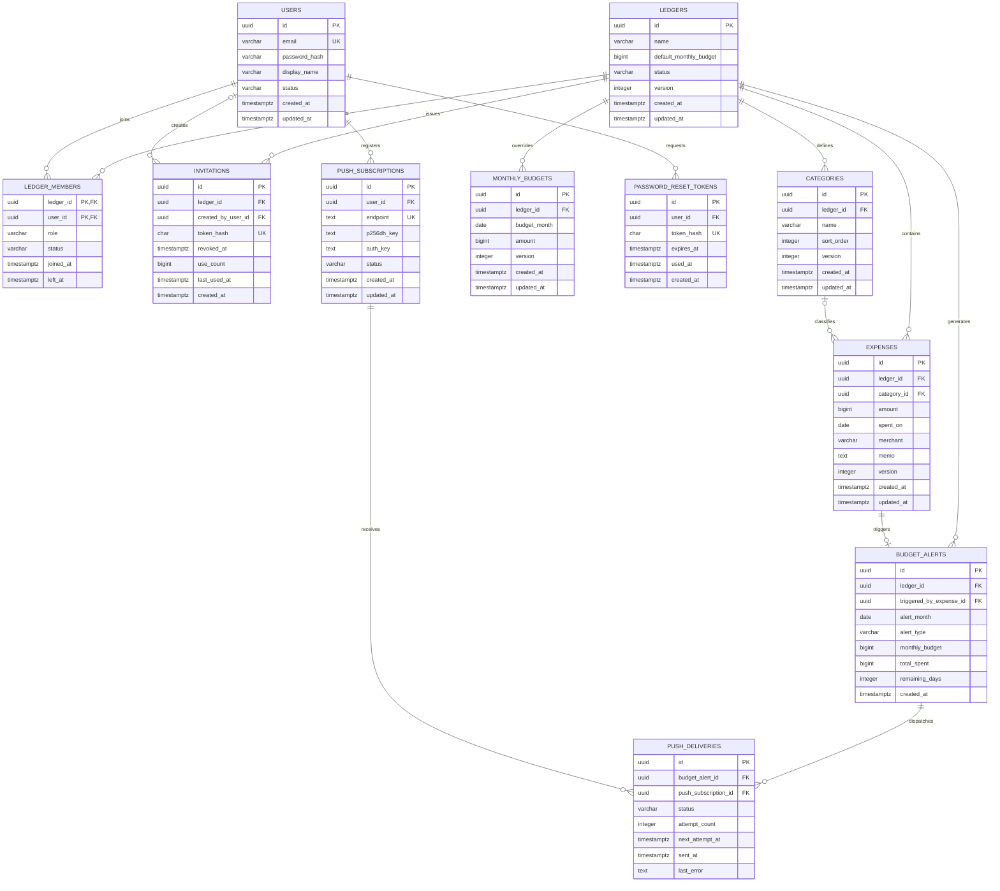

# MealBudgetDiet ERD 및 데이터 모델

- 문서 버전: 1.1
- 관련 문서: [requirements.md](requirements.md), [architecture.md](architecture.md)
- DBMS: PostgreSQL 18

## 1. ERD



Spring Session JDBC가 생성하는 세션 테이블은 애플리케이션 도메인 ERD에서 제외한다.

## 2. 테이블 정의

### 2.1 ledgers

실제 환경에서 단 하나의 공용 식비 장부를 표현한다. 테이블을 별도로 두어 데이터 소유 경계와 전체 삭제 범위를 명확하게 한다.

| 컬럼 | 타입 | Null | 규칙 |
|---|---|:---:|---|
| id | uuid | N | PK |
| name | varchar(100) | N | 장부 표시 이름 |
| default_monthly_budget | bigint | N | 0보다 큰 원화 정수 |
| status | varchar(20) | N | ACTIVE, TERMINATING |
| version | integer | N | optimistic lock |
| created_at | timestamptz | N | 생성 시각 |
| updated_at | timestamptz | N | 최종 수정 시각 |

운영 profile에서는 ACTIVE 장부가 하나만 존재하도록 application invariant와 초기화 절차로 제한한다. 데모 환경은 별도 DB를 사용한다.

### 2.2 users

로그인 계정과 화면 표시 이름을 저장한다.

| 컬럼 | 타입 | Null | 규칙 |
|---|---|:---:|---|
| id | uuid | N | PK |
| email | varchar(320) | N | 소문자 정규화 후 unique |
| password_hash | varchar(255) | Y | 탈퇴 시 제거 가능 |
| display_name | varchar(50) | N | 탈퇴 후에도 유지 |
| status | varchar(20) | N | ACTIVE, WITHDRAWN |
| created_at | timestamptz | N | 생성 시각 |
| updated_at | timestamptz | N | 최종 수정 시각 |

- 이메일 비교 전 trim과 소문자 정규화를 수행한다.
- WITHDRAWN 사용자는 로그인할 수 없다.
- 탈퇴 시 기존 세션과 비밀번호 재설정 토큰을 폐기한다.
- 표시 이름은 요구사항에 따라 유지한다.
- 재가입 정책은 구현 단계에서 동일 이메일 계정 재활성 방식으로 처리한다.

### 2.3 ledger_members

사용자와 공용 장부의 참여 관계 및 관리자 역할을 저장한다.

| 컬럼 | 타입 | Null | 규칙 |
|---|---|:---:|---|
| ledger_id | uuid | N | ledgers FK, 복합 PK |
| user_id | uuid | N | users FK, 복합 PK |
| role | varchar(20) | N | MEMBER, ADMIN |
| status | varchar(20) | N | ACTIVE, LEFT |
| joined_at | timestamptz | N | 참여 시각 |
| left_at | timestamptz | Y | 탈퇴 시각 |

핵심 제약:

- 하나의 장부에는 ACTIVE ADMIN이 최소 한 명 존재해야 한다.
- 마지막 관리자의 탈퇴는 일반 탈퇴가 아니라 장부 종료 use case로 처리한다.
- 강제 탈퇴 API는 제공하지 않는다.
- 관리자는 본인을 마지막 관리자로 만드는 관리자 해제를 수행할 수 없다.

### 2.4 invitations

재사용 가능한 초대 코드를 저장한다.

| 컬럼 | 타입 | Null | 규칙 |
|---|---|:---:|---|
| id | uuid | N | PK |
| ledger_id | uuid | N | ledgers FK |
| created_by_user_id | uuid | Y | users FK |
| token_hash | char(64) | N | SHA-256 hex, unique |
| revoked_at | timestamptz | Y | null이면 활성 |
| use_count | bigint | N | 기본값 0 |
| last_used_at | timestamptz | Y | 최근 사용 시각 |
| created_at | timestamptz | N | 발급 시각 |

- 초대 코드 원문은 생성 응답에서 한 번만 반환한다.
- DB에는 SHA-256 해시만 저장한다.
- expires_at은 두지 않는다.
- revoked_at이 설정되면 더 이상 가입에 사용할 수 없다.
- 하나의 활성 코드를 여러 사용자가 사용할 수 있다.

### 2.5 categories

식비 분류를 저장한다.

| 컬럼 | 타입 | Null | 규칙 |
|---|---|:---:|---|
| id | uuid | N | PK |
| ledger_id | uuid | N | ledgers FK |
| name | varchar(50) | N | 장부 안에서 unique |
| sort_order | integer | N | 목록 표시 순서 |
| version | integer | N | optimistic lock |
| created_at | timestamptz | N | 생성 시각 |
| updated_at | timestamptz | N | 최종 수정 시각 |

초기 데이터:

1. 장보기
2. 외식
3. 배달
4. 카페/간식
5. 기타

삭제 정책:

- 카테고리는 물리 삭제한다.
- expenses.category_id FK는 `ON DELETE SET NULL`을 사용한다.
- 삭제 후 기존 식비와 통계에는 ‘분류 없음’으로 표시한다.

### 2.6 expenses

공용 자금에서 지출한 식비 원본 데이터를 저장한다.

| 컬럼 | 타입 | Null | 규칙 |
|---|---|:---:|---|
| id | uuid | N | PK |
| ledger_id | uuid | N | ledgers FK |
| category_id | uuid | Y | categories FK, 삭제 시 null |
| amount | bigint | N | 0보다 큰 원화 정수 |
| spent_on | date | N | 식비 사용일 |
| merchant | varchar(100) | Y | 상호명 |
| memo | text | Y | 메모 |
| version | integer | N | optimistic lock |
| created_at | timestamptz | N | 생성 시각 |
| updated_at | timestamptz | N | 최종 수정 시각 |

- 신규 등록 시 category_id는 반드시 활성 카테고리를 가리켜야 한다.
- 카테고리 삭제 이후에만 category_id가 null일 수 있다.
- 지출 사용자, 등록자, 수정자 컬럼은 두지 않는다.
- 삭제는 물리 삭제하며 복구 및 변경 이력을 제공하지 않는다.
- merchant와 memo의 공백 문자열은 null로 정규화한다.

### 2.7 monthly_budgets

기본 월 예산과 다른 특정 월의 예산만 저장한다.

| 컬럼 | 타입 | Null | 규칙 |
|---|---|:---:|---|
| id | uuid | N | PK |
| ledger_id | uuid | N | ledgers FK |
| budget_month | date | N | 해당 월의 1일 |
| amount | bigint | N | 0보다 큰 원화 정수 |
| version | integer | N | optimistic lock |
| created_at | timestamptz | N | 생성 시각 |
| updated_at | timestamptz | N | 최종 수정 시각 |

- `unique (ledger_id, budget_month)`
- 특정 월 행이 없으면 ledgers.default_monthly_budget을 사용한다.
- 예산은 다음 달로 이월하지 않는다.
- override를 삭제하면 해당 월은 다시 기본 예산을 사용한다.

### 2.8 password_reset_tokens

일회용 비밀번호 재설정 토큰을 저장한다.

| 컬럼 | 타입 | Null | 규칙 |
|---|---|:---:|---|
| id | uuid | N | PK |
| user_id | uuid | N | users FK |
| token_hash | char(64) | N | SHA-256 hex, unique |
| expires_at | timestamptz | N | 기본 발급 후 30분 |
| used_at | timestamptz | Y | 사용 완료 시각 |
| created_at | timestamptz | N | 발급 시각 |

유효 조건:

```text
used_at IS NULL
AND expires_at > current_timestamp
AND user.status = ACTIVE
```

### 2.9 push_subscriptions

사용자가 푸시 알림을 허용한 브라우저 기기의 Web Push 구독을 저장한다.

| 컬럼 | 타입 | Null | 규칙 |
|---|---|:---:|---|
| id | uuid | N | PK |
| user_id | uuid | N | users FK |
| endpoint | text | N | push service endpoint, unique |
| p256dh_key | text | N | payload 암호화 공개키 |
| auth_key | text | N | Web Push auth secret |
| status | varchar(20) | N | ACTIVE, EXPIRED, DISABLED |
| created_at | timestamptz | N | 등록 시각 |
| updated_at | timestamptz | N | 최종 갱신 시각 |

- 한 사용자가 여러 기기를 등록할 수 있다.
- 사용자가 알림을 해제하면 DISABLED로 변경하거나 삭제한다.
- push service가 404 또는 410을 반환하면 EXPIRED로 변경한다.
- endpoint와 key는 민감 데이터로 취급하고 로그에 출력하지 않는다.

### 2.10 budget_alerts

월 예산 여유 조건을 처음 만족했음을 나타내는 논리적 알림 이벤트다.

| 컬럼 | 타입 | Null | 규칙 |
|---|---|:---:|---|
| id | uuid | N | PK |
| ledger_id | uuid | N | ledgers FK |
| triggered_by_expense_id | uuid | Y | expenses FK, 식비 삭제 시 null |
| alert_month | date | N | 해당 월의 1일 |
| alert_type | varchar(40) | N | MONTHLY_BUDGET_SURPLUS |
| monthly_budget | bigint | N | 판정 시 적용 예산 |
| total_spent | bigint | N | 판정 직후 월 누적 식비 |
| remaining_days | integer | N | 오늘 포함 남은 일수 |
| created_at | timestamptz | N | 조건 충족 시각 |

- `unique (ledger_id, alert_month, alert_type)`로 월 1회만 생성한다.
- 식비 수정과 삭제에서는 생성하지 않는다.
- 현재 월에 속한 식비 신규 등록에서만 생성한다.
- 판정 당시 값을 snapshot으로 저장해 운영 시 알림 사유를 확인할 수 있게 한다.

### 2.11 push_deliveries

하나의 논리적 예산 알림을 기기별로 전달한 상태를 저장한다.

| 컬럼 | 타입 | Null | 규칙 |
|---|---|:---:|---|
| id | uuid | N | PK |
| budget_alert_id | uuid | N | budget_alerts FK |
| push_subscription_id | uuid | N | push_subscriptions FK |
| status | varchar(20) | N | PENDING, SENDING, SENT, FAILED |
| attempt_count | integer | N | 기본값 0 |
| next_attempt_at | timestamptz | Y | 다음 재시도 시각 |
| sent_at | timestamptz | Y | 성공 시각 |
| last_error | text | Y | 민감정보를 제거한 오류 |
| created_at | timestamptz | N | 생성 시각 |
| updated_at | timestamptz | N | 최종 갱신 시각 |

- `unique (budget_alert_id, push_subscription_id)`
- PENDING 전송을 별도 dispatcher가 조회해 발송한다.
- 재시도 횟수는 제한하며 영구 실패 후 FAILED로 종료한다.

## 3. 외래 키 삭제 정책

| 부모 | 자식 | 삭제 정책 |
|---|---|---|
| ledgers | ledger_members | ON DELETE CASCADE |
| ledgers | invitations | ON DELETE CASCADE |
| ledgers | categories | ON DELETE CASCADE |
| ledgers | expenses | ON DELETE CASCADE |
| ledgers | monthly_budgets | ON DELETE CASCADE |
| users | ledger_members | RESTRICT |
| users | invitations.created_by_user_id | SET NULL |
| users | password_reset_tokens | ON DELETE CASCADE |
| users | push_subscriptions | ON DELETE CASCADE |
| ledgers | budget_alerts | ON DELETE CASCADE |
| expenses | budget_alerts.triggered_by_expense_id | ON DELETE SET NULL |
| budget_alerts | push_deliveries | ON DELETE CASCADE |
| push_subscriptions | push_deliveries | ON DELETE CASCADE |
| categories | expenses | ON DELETE SET NULL |

장부 종료 시 ledger 한 건을 삭제해 관련 식비, 분류, 예산, 초대, 참여 관계를 함께 제거한다. 사용자 계정 처리는 장부 종료 application service가 명시적으로 수행한다.

## 4. 주요 제약조건

```text
ledgers.default_monthly_budget > 0
expenses.amount > 0
monthly_budgets.amount > 0
monthly_budgets.budget_month = date_trunc('month', budget_month)::date
categories.name <> ''
users.display_name <> ''
invitations.use_count >= 0
```

Enum 성격의 문자열에는 CHECK 제약조건을 둔다.

```text
ledgers.status IN ('ACTIVE', 'TERMINATING')
users.status IN ('ACTIVE', 'WITHDRAWN')
ledger_members.role IN ('MEMBER', 'ADMIN')
ledger_members.status IN ('ACTIVE', 'LEFT')
push_subscriptions.status IN ('ACTIVE', 'EXPIRED', 'DISABLED')
budget_alerts.alert_type IN ('MONTHLY_BUDGET_SURPLUS')
push_deliveries.status IN ('PENDING', 'SENDING', 'SENT', 'FAILED')
```

## 5. 인덱스

### 5.1 식비 목록

```sql
CREATE INDEX idx_expenses_ledger_spent_created
    ON expenses (ledger_id, spent_on DESC, created_at DESC, id DESC);
```

목록 커서는 `spent_on + created_at + id`를 사용한다.

### 5.2 기간·카테고리 통계

```sql
CREATE INDEX idx_expenses_ledger_category_spent
    ON expenses (ledger_id, category_id, spent_on);
```

초기 데이터 규모에서는 통계 쿼리 실행 계획을 측정해 중복 인덱스가 되는 경우 이 인덱스를 제거한다.

### 5.3 회원과 초대

```sql
CREATE INDEX idx_members_ledger_status
    ON ledger_members (ledger_id, status);

CREATE UNIQUE INDEX uk_invitations_token_hash
    ON invitations (token_hash);
```

### 5.4 월 예산

```sql
CREATE UNIQUE INDEX uk_monthly_budgets_ledger_month
    ON monthly_budgets (ledger_id, budget_month);
```

### 5.5 푸시 알림

```sql
CREATE UNIQUE INDEX uk_budget_alerts_month_type
    ON budget_alerts (ledger_id, alert_month, alert_type);

CREATE UNIQUE INDEX uk_push_deliveries_target
    ON push_deliveries (budget_alert_id, push_subscription_id);

CREATE INDEX idx_push_deliveries_pending
    ON push_deliveries (status, next_attempt_at)
    WHERE status IN ('PENDING', 'FAILED');
```

## 6. 목록 커서

식비 목록의 정렬 기준은 다음 순서다.

```sql
ORDER BY spent_on DESC, created_at DESC, id DESC
```

다음 페이지 조건:

```sql
WHERE ledger_id = :ledgerId
  AND (spent_on, created_at, id) < (:spentOn, :createdAt, :id)
ORDER BY spent_on DESC, created_at DESC, id DESC
LIMIT :sizePlusOne
```

커서 값은 Base64 URL-safe JSON 또는 불투명 서명 문자열로 전달하며 클라이언트가 내부 값을 수정하지 못하게 검증한다.

## 7. 통계 계산 원칙

- 식비 원본인 expenses를 기준으로 계산한다.
- 금액 합계는 bigint 범위 안에서 정수 연산한다.
- category_id가 null이면 ‘분류 없음’으로 그룹화한다.
- 월 예산은 monthly_budgets 행이 있으면 해당 값을, 없으면 ledgers.default_monthly_budget을 사용한다.
- 예산 사용률은 응답 시 소수점 두 자리까지 계산하고 DB에는 저장하지 않는다.
- 0건인 기간의 총 식비는 null이 아니라 0을 반환한다.
- 날짜 경계는 Asia/Seoul을 기준으로 결정한 뒤 date 조건으로 조회한다.

## 8. Flyway 마이그레이션 초안

```text
V1__create_identity_and_ledger.sql
V2__create_expense_and_category.sql
V3__create_budget.sql
V4__create_password_reset.sql
V5__create_spring_session_tables.sql
V6__insert_default_categories.sql
V7__create_push_notification_tables.sql
```

마이그레이션은 적용 후 수정하지 않고 새 버전 파일로 변경을 이어간다.
