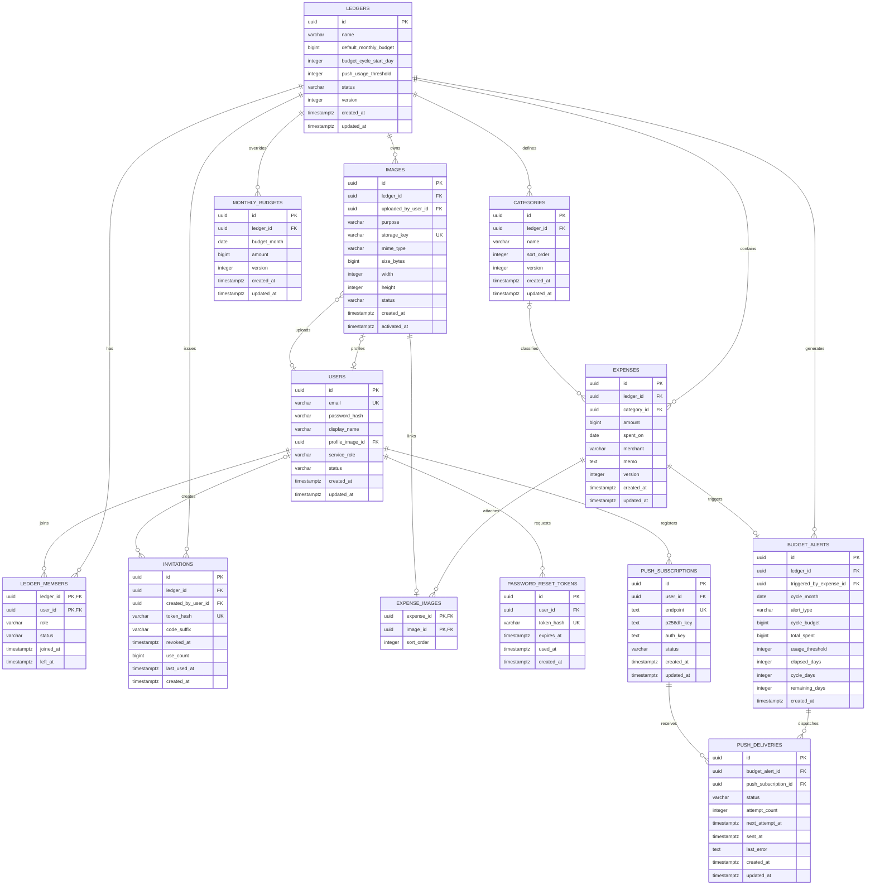

# MealBudgetDiet ERD 및 데이터 모델

- 문서 버전: 1.2
- 관련 문서: [requirements.md](requirements.md), [architecture.md](architecture.md)
- DBMS: PostgreSQL 18

## 1. ERD



Spring Session JDBC가 생성하는 세션 테이블은 애플리케이션 도메인 ERD에서 제외한다. 애플리케이션 시간 제한은 두지 않으며 로그아웃, 비밀번호 변경·재설정, 탈퇴 시 대상 세션을 명시적으로 삭제한다.

## 2. 테이블 정의

### 2.1 ledgers

서비스 안의 독립적인 식비 장부를 표현한다. 각 장부를 별도 데이터 소유 경계로 두어 권한과 전체 삭제 범위를 명확하게 한다.

| 컬럼 | 타입 | Null | 규칙 |
|---|---|:---:|---|
| id | uuid | N | PK |
| name | varchar(100) | N | 장부 표시 이름 |
| default_monthly_budget | bigint | N | 0보다 큰 원화 정수 |
| budget_cycle_start_day | integer | N | 기본값 1, 1~31 |
| push_usage_threshold | integer | N | 기본값 80, 1~100 정수 백분율 |
| status | varchar(20) | N | ACTIVE, TERMINATING |
| version | integer | N | optimistic lock |
| created_at | timestamptz | N | 생성 시각 |
| updated_at | timestamptz | N | 최종 수정 시각 |

운영 서비스는 여러 ACTIVE 장부를 지원한다. 현재 UI에서는 계정 하나가 하나의 ACTIVE 장부를 만들거나 초대로 참여하며, 서비스 관리자는 Bootstrap에서 자신의 첫 장부도 함께 생성한다. 데모 환경은 별도 DB를 사용한다.

### 2.2 users

로그인 계정, 화면 표시 이름과 현재 프로필 이미지를 저장한다.

| 컬럼 | 타입 | Null | 규칙 |
|---|---|:---:|---|
| id | uuid | N | PK |
| email | varchar(320) | N | 소문자 정규화 후 unique, 탈퇴 시 비식별 대체값 |
| password_hash | varchar(255) | Y | 탈퇴 시 제거 가능 |
| display_name | varchar(50) | N | 탈퇴 시 공통 비식별 표시값으로 교체 |
| profile_image_id | uuid | Y | images FK, 본인 활성 PROFILE 이미지 |
| service_role | varchar(20) | N | USER, SERVICE_ADMIN |
| status | varchar(20) | N | ACTIVE, WITHDRAWN |
| created_at | timestamptz | N | 생성 시각 |
| updated_at | timestamptz | N | 최종 수정 시각 |

- `service_role`은 서비스 운영 권한이며 장부 권한과 독립적이다.
- 이메일 비교 전 trim과 소문자 정규화를 수행한다.
- WITHDRAWN 사용자는 로그인할 수 없다.
- 탈퇴 시 이메일과 표시 이름을 비식별 값으로 교체하고 기존 세션과 비밀번호 재설정 토큰을 폐기한다.
- 프로필 이미지를 교체·삭제하거나 탈퇴하면 참조를 제거하고 미참조 이미지와 Object Storage 객체를 삭제한다.
- 공유 장부 기록은 탈퇴 계정의 원래 식별정보와 연결되지 않은 상태로 유지할 수 있다.
- 같은 이메일로 재가입하면 이전 계정을 재활성화하지 않고 새 계정을 생성한다.

### 2.3 ledger_members

사용자와 장부의 참여 관계 및 장부 역할을 저장한다. `ADMIN`은 해당 장부 관리자이고 `MEMBER`는 해당 장부를 사용하는 멤버다.

| 컬럼 | 타입 | Null | 규칙 |
|---|---|:---:|---|
| ledger_id | uuid | N | ledgers FK, 복합 PK |
| user_id | uuid | N | users FK, 복합 PK |
| role | varchar(20) | N | MEMBER, ADMIN |
| status | varchar(20) | N | ACTIVE, LEFT |
| joined_at | timestamptz | N | 참여 시각 |
| left_at | timestamptz | Y | 탈퇴 시각 |

핵심 제약:

- 하나의 장부에는 ACTIVE ADMIN이 최소 한 명 존재해야 한다.
- 마지막 관리자의 탈퇴는 일반 탈퇴가 아니라 장부 종료 use case로 처리한다.
- 강제 탈퇴 API는 제공하지 않는다.
- 관리자는 본인을 마지막 관리자로 만드는 관리자 해제를 수행할 수 없다.

### 2.4 invitations

재사용 가능한 초대 코드를 저장한다.

| 컬럼 | 타입 | Null | 규칙 |
|---|---|:---:|---|
| id | uuid | N | PK |
| ledger_id | uuid | N | ledgers FK |
| created_by_user_id | uuid | Y | users FK |
| token_hash | varchar(64) | N | SHA-256 hex, unique |
| code_suffix | varchar(4) | N | 목록 마스킹용 원문 끝 4자리 |
| revoked_at | timestamptz | Y | null이면 활성 |
| use_count | bigint | N | 기본값 0 |
| last_used_at | timestamptz | Y | 최근 사용 시각 |
| created_at | timestamptz | N | 발급 시각 |

- 초대 코드 원문은 생성 응답에서 한 번만 반환한다.
- DB에는 SHA-256 해시만 저장한다.
- 목록에서는 원문 대신 code_suffix를 사용한 마스킹 코드만 표시한다.
- expires_at은 두지 않는다.
- revoked_at이 설정되면 더 이상 가입에 사용할 수 없다.
- 하나의 활성 코드를 여러 사용자가 사용할 수 있다.

### 2.5 categories

식비 분류를 저장한다.

| 컬럼 | 타입 | Null | 규칙 |
|---|---|:---:|---|
| id | uuid | N | PK |
| ledger_id | uuid | N | ledgers FK |
| name | varchar(50) | N | 장부 안에서 unique |
| sort_order | integer | N | 목록 표시 순서 |
| version | integer | N | optimistic lock |
| created_at | timestamptz | N | 생성 시각 |
| updated_at | timestamptz | N | 최종 수정 시각 |

초기 데이터:

1. 장보기
2. 외식
3. 배달
4. 카페/간식
5. 기타

삭제 정책:

- 카테고리는 물리 삭제한다.
- expenses.category_id FK는 `ON DELETE SET NULL`을 사용한다.
- 삭제 후 기존 식비와 통계에는 ‘분류 없음’으로 표시한다.

### 2.6 expenses

공용 자금에서 지출한 식비 원본 데이터를 저장한다.

| 컬럼 | 타입 | Null | 규칙 |
|---|---|:---:|---|
| id | uuid | N | PK |
| ledger_id | uuid | N | ledgers FK |
| category_id | uuid | Y | categories FK, 삭제 시 null |
| amount | bigint | N | 0보다 큰 원화 정수 |
| spent_on | date | N | 식비 사용일 |
| merchant | varchar(100) | Y | 상호명 |
| memo | text | Y | 메모 |
| version | integer | N | optimistic lock |
| created_at | timestamptz | N | 생성 시각 |
| updated_at | timestamptz | N | 최종 수정 시각 |

- 신규 등록 시 category_id는 반드시 활성 카테고리를 가리켜야 한다.
- 카테고리 삭제 이후에만 category_id가 null일 수 있다.
- 지출 사용자, 등록자, 수정자 컬럼은 두지 않는다.
- 삭제는 물리 삭제하며 복구 및 변경 이력을 제공하지 않는다.
- merchant와 memo의 공백 문자열은 null로 정규화한다.

### 2.7 images와 expense_images

업로드 이미지의 저장 메타데이터와 식비별 표시 순서를 저장한다. 바이너리는 DB가 아니라 비공개 Object Storage에 둔다.

`images`:

| 컬럼 | 타입 | Null | 규칙 |
|---|---|:---:|---|
| id | uuid | N | PK |
| ledger_id | uuid | N | ledgers FK, 접근 권한 경계 |
| uploaded_by_user_id | uuid | Y | users FK, 탈퇴 시 null |
| purpose | varchar(20) | N | EXPENSE, PROFILE |
| storage_key | varchar(500) | N | 추측 불가능한 내부 키, unique |
| mime_type | varchar(50) | N | 변환본은 image/webp |
| size_bytes | bigint | N | 0보다 크고 5MB 이하인 업로드 원본을 처리한 결과 |
| width | integer | N | 0보다 큰 변환본 너비 |
| height | integer | N | 0보다 큰 변환본 높이 |
| status | varchar(20) | N | TEMP, ACTIVE |
| created_at | timestamptz | N | 업로드 완료 시각 |
| activated_at | timestamptz | Y | 리소스 연결 시각 |

`expense_images`:

| 컬럼 | 타입 | Null | 규칙 |
|---|---|:---:|---|
| expense_id | uuid | N | expenses FK, 복합 PK |
| image_id | uuid | N | images FK, 복합 PK이며 전체 unique |
| sort_order | integer | N | 0~2, 식비 안에서 unique |

- 한 식비에는 최대 3개의 `EXPENSE` 이미지만 연결한다.
- 사용자는 본인이 올린 `TEMP` 이미지만 식비 또는 프로필에 연결할 수 있다.
- 연결 시 장부와 purpose가 대상 리소스와 일치해야 하며 `ACTIVE`로 전환한다.
- `PROFILE` 이미지는 한 사용자에게만 연결하고, `EXPENSE` 이미지는 한 식비에만 연결한다.
- 보존 시간이 지난 `TEMP`와 더 이상 참조되지 않는 `ACTIVE` 행 및 객체는 정리 작업으로 삭제한다.

### 2.8 monthly_budgets

기본 월 예산과 다른 특정 예산 주기의 예산만 저장한다.

| 컬럼 | 타입 | Null | 규칙 |
|---|---|:---:|---|
| id | uuid | N | PK |
| ledger_id | uuid | N | ledgers FK |
| budget_month | date | N | 예산 주기 시작일이 속한 연·월의 1일 |
| amount | bigint | N | 0보다 큰 원화 정수 |
| version | integer | N | optimistic lock |
| created_at | timestamptz | N | 생성 시각 |
| updated_at | timestamptz | N | 최종 수정 시각 |

- `unique (ledger_id, budget_month)`
- 해당 예산 주기의 시작 연·월 행이 없으면 ledgers.default_monthly_budget을 사용한다.
- 예산은 다음 달로 이월하지 않는다.
- override를 삭제하면 해당 예산 주기는 다시 기본 예산을 사용한다.

### 2.9 password_reset_tokens

일회용 비밀번호 재설정 토큰을 저장한다.

| 컬럼 | 타입 | Null | 규칙 |
|---|---|:---:|---|
| id | uuid | N | PK |
| user_id | uuid | N | users FK |
| token_hash | varchar(64) | N | SHA-256 hex, unique |
| expires_at | timestamptz | N | 기본 발급 후 30분 |
| used_at | timestamptz | Y | 사용 완료 시각 |
| created_at | timestamptz | N | 발급 시각 |

유효 조건:

```text
used_at IS NULL
AND expires_at > current_timestamp
AND user.status = ACTIVE
```

### 2.9.1 auth_rate_limits

서버 인스턴스 전체에서 공유하는 인증 요청 고정 윈도우 카운터를 저장한다.

| 컬럼 | 타입 | Null | 규칙 |
|---|---|:---:|---|
| scope | varchar(40) | N | PK 일부, 제한 종류 |
| subject_hash | varchar(64) | N | PK 일부, 환경별 HMAC-SHA-256 식별자 |
| window_started_at | timestamptz | N | 현재 고정 윈도우 시작 시각 |
| attempt_count | integer | N | 윈도우 내 요청 횟수, 0보다 큼 |
| updated_at | timestamptz | N | 최종 요청 시각, 만료 행 정리 기준 |

- 이메일, 클라이언트 주소와 비밀번호는 원문으로 저장하지 않는다.
- 로그인 성공 시 해당 이메일·클라이언트 조합의 카운터를 삭제한다.
- 오래된 카운터는 예약 정리 작업으로 삭제한다.

### 2.10 push_subscriptions

사용자가 푸시 알림을 허용한 브라우저 기기의 Web Push 구독을 저장한다.

| 컬럼 | 타입 | Null | 규칙 |
|---|---|:---:|---|
| id | uuid | N | PK |
| user_id | uuid | N | users FK |
| endpoint | text | N | push service endpoint, unique |
| p256dh_key | text | N | payload 암호화 공개키 |
| auth_key | text | N | Web Push auth secret |
| status | varchar(20) | N | ACTIVE, EXPIRED, DISABLED |
| created_at | timestamptz | N | 등록 시각 |
| updated_at | timestamptz | N | 최종 갱신 시각 |

- 한 사용자가 여러 기기를 등록할 수 있다.
- 사용자가 알림을 해제하면 DISABLED로 변경하거나 삭제한다.
- push service가 404 또는 410을 반환하면 EXPIRED로 변경한다.
- endpoint와 key는 민감 데이터로 취급하고 로그에 출력하지 않는다.

### 2.11 budget_alerts

예산 주기 초과 위험 조건을 처음 만족했음을 나타내는 논리적 알림 이벤트다.

| 컬럼 | 타입 | Null | 규칙 |
|---|---|:---:|---|
| id | uuid | N | PK |
| ledger_id | uuid | N | ledgers FK |
| triggered_by_expense_id | uuid | Y | expenses FK, 식비 삭제 시 null |
| cycle_month | date | N | 예산 주기 시작일이 속한 연·월의 1일 |
| alert_type | varchar(40) | N | MONTHLY_BUDGET_OVERRUN_RISK, 과거 MONTHLY_BUDGET_SURPLUS |
| cycle_budget | bigint | N | 판정 시 적용 예산 |
| total_spent | bigint | N | 판정 직후 주기 누적 식비 |
| usage_threshold | integer | N | 판정 시 장부 Push 기준 사용률 |
| elapsed_days | integer | N | 오늘 포함 경과일수 |
| cycle_days | integer | N | 해당 예산 주기의 전체 일수 |
| remaining_days | integer | N | 오늘 포함 남은 일수 |
| created_at | timestamptz | N | 조건 충족 시각 |

- `unique (ledger_id, cycle_month, alert_type)`로 예산 주기당 1회만 생성한다.
- 식비 수정과 삭제에서는 생성하지 않는다.
- 현재 예산 주기에 속한 식비 신규 등록에서만 생성한다.
- 판정 당시 값을 snapshot으로 저장해 운영 시 알림 사유를 확인할 수 있게 한다.

생성 조건:

```text
totalSpent * 100 >= cycleBudget * usageThreshold
AND
totalSpent * cycleDays > cycleBudget * elapsedDays
```

예산 주기 경계와 elapsedDays는 장부의 시작일과 Asia/Seoul 날짜를 기준으로 계산한다. 판정 시점의 기준값과 일수를 snapshot으로 함께 저장해 설정 변경 이후에도 발송 사유를 재현할 수 있게 한다.

### 2.12 push_deliveries

하나의 논리적 예산 알림을 기기별로 전달한 상태를 저장한다.

| 컬럼 | 타입 | Null | 규칙 |
|---|---|:---:|---|
| id | uuid | N | PK |
| budget_alert_id | uuid | N | budget_alerts FK |
| push_subscription_id | uuid | N | push_subscriptions FK |
| status | varchar(20) | N | PENDING, SENDING, SENT, FAILED |
| attempt_count | integer | N | 기본값 0 |
| next_attempt_at | timestamptz | Y | 다음 재시도 시각 |
| sent_at | timestamptz | Y | 성공 시각 |
| last_error | text | Y | 민감정보를 제거한 오류 |
| created_at | timestamptz | N | 생성 시각 |
| updated_at | timestamptz | N | 최종 갱신 시각 |

- `unique (budget_alert_id, push_subscription_id)`
- PENDING 전송을 별도 dispatcher가 조회해 발송한다.
- 재시도 횟수는 제한하며 영구 실패 후 FAILED로 종료한다.

## 3. 외래 키 삭제 정책

| 부모 | 자식 | 삭제 정책 |
|---|---|---|
| ledgers | ledger_members | ON DELETE CASCADE |
| ledgers | invitations | ON DELETE CASCADE |
| ledgers | categories | ON DELETE CASCADE |
| ledgers | expenses | ON DELETE CASCADE |
| ledgers | images | ON DELETE CASCADE |
| ledgers | monthly_budgets | ON DELETE CASCADE |
| users | ledger_members | RESTRICT |
| users | invitations.created_by_user_id | SET NULL |
| users | password_reset_tokens | ON DELETE CASCADE |
| users | push_subscriptions | ON DELETE CASCADE |
| users | images.uploaded_by_user_id | ON DELETE SET NULL |
| images | users.profile_image_id | ON DELETE SET NULL |
| expenses | expense_images | ON DELETE CASCADE |
| images | expense_images | ON DELETE CASCADE |
| ledgers | budget_alerts | ON DELETE CASCADE |
| expenses | budget_alerts.triggered_by_expense_id | ON DELETE SET NULL |
| budget_alerts | push_deliveries | ON DELETE CASCADE |
| push_subscriptions | push_deliveries | ON DELETE CASCADE |
| categories | expenses | ON DELETE SET NULL |

장부 종료 시 ledger 한 건을 삭제해 관련 식비, 분류, 예산, 초대, 참여 관계를 함께 제거한다. 사용자 계정 처리는 장부 종료 application service가 명시적으로 수행한다.

## 4. 주요 제약조건

```text
ledgers.default_monthly_budget > 0
ledgers.budget_cycle_start_day BETWEEN 1 AND 31
ledgers.push_usage_threshold BETWEEN 1 AND 100
expenses.amount > 0
images.size_bytes > 0
images.width > 0
images.height > 0
expense_images.sort_order BETWEEN 0 AND 2
monthly_budgets.amount > 0
monthly_budgets.budget_month = date_trunc('month', budget_month)::date
categories.name <> ''
users.display_name <> ''
invitations.use_count >= 0
```

Enum 성격의 문자열에는 CHECK 제약조건을 둔다.

```text
ledgers.status IN ('ACTIVE', 'TERMINATING')
users.service_role IN ('USER', 'SERVICE_ADMIN')
users.status IN ('ACTIVE', 'WITHDRAWN')
ledger_members.role IN ('MEMBER', 'ADMIN')
ledger_members.status IN ('ACTIVE', 'LEFT')
push_subscriptions.status IN ('ACTIVE', 'EXPIRED', 'DISABLED')
images.purpose IN ('EXPENSE', 'PROFILE')
images.status IN ('TEMP', 'ACTIVE')
budget_alerts.alert_type IN ('MONTHLY_BUDGET_SURPLUS', 'MONTHLY_BUDGET_OVERRUN_RISK')
push_deliveries.status IN ('PENDING', 'SENDING', 'SENT', 'FAILED')
```

## 5. 인덱스

### 5.1 식비 목록

```sql
CREATE INDEX idx_expenses_ledger_spent_created
    ON expenses (ledger_id, spent_on DESC, created_at DESC, id DESC);
```

목록 커서는 `spent_on + created_at + id`를 사용한다.

### 5.2 기간·카테고리 통계

```sql
CREATE INDEX idx_expenses_ledger_category_spent
    ON expenses (ledger_id, category_id, spent_on);
```

초기 데이터 규모에서는 통계 쿼리 실행 계획을 측정해 중복 인덱스가 되는 경우 이 인덱스를 제거한다.

### 5.3 회원과 초대

```sql
CREATE INDEX idx_members_ledger_status
    ON ledger_members (ledger_id, status);

CREATE UNIQUE INDEX uk_invitations_token_hash
    ON invitations (token_hash);
```

### 5.4 월 예산

```sql
CREATE UNIQUE INDEX uk_monthly_budgets_ledger_month
    ON monthly_budgets (ledger_id, budget_month);
```

### 5.5 푸시 알림

```sql
CREATE UNIQUE INDEX uk_budget_alerts_month_type
    ON budget_alerts (ledger_id, cycle_month, alert_type);

CREATE UNIQUE INDEX uk_push_deliveries_target
    ON push_deliveries (budget_alert_id, push_subscription_id);

CREATE INDEX idx_push_deliveries_pending
    ON push_deliveries (status, next_attempt_at)
    WHERE status IN ('PENDING', 'FAILED');
```

### 5.6 이미지

```sql
CREATE UNIQUE INDEX uk_images_storage_key
    ON images (storage_key);

CREATE UNIQUE INDEX uk_users_profile_image
    ON users (profile_image_id)
    WHERE profile_image_id IS NOT NULL;

CREATE UNIQUE INDEX uk_expense_images_image
    ON expense_images (image_id);

CREATE UNIQUE INDEX uk_expense_images_order
    ON expense_images (expense_id, sort_order);

CREATE INDEX idx_images_temp_created
    ON images (created_at)
    WHERE status = 'TEMP';
```

## 6. 목록 커서

식비 목록의 정렬 기준은 다음 순서다.

```sql
ORDER BY spent_on DESC, created_at DESC, id DESC
```

다음 페이지 조건:

```sql
WHERE ledger_id = :ledgerId
  AND (spent_on, created_at, id) < (:spentOn, :createdAt, :id)
ORDER BY spent_on DESC, created_at DESC, id DESC
LIMIT :sizePlusOne
```

커서 값은 Base64 URL-safe JSON 또는 불투명 서명 문자열로 전달하며 클라이언트가 내부 값을 수정하지 못하게 검증한다.

## 7. 통계 계산 원칙

- 식비 원본인 expenses를 기준으로 계산한다.
- 금액 합계는 bigint 범위 안에서 정수 연산한다.
- category_id가 null이면 ‘분류 없음’으로 그룹화한다.
- 장부의 시작일로 예산 주기를 계산하고, 주기 시작 연·월의 monthly_budgets 행이 있으면 해당 값을 사용하며 없으면 ledgers.default_monthly_budget을 사용한다.
- 예산 사용률은 응답 시 소수점 두 자리까지 계산하고 DB에는 저장하지 않는다.
- 0건인 기간의 총 식비는 null이 아니라 0을 반환한다.
- 날짜 경계는 Asia/Seoul을 기준으로 결정한 뒤 date 조건으로 조회한다.

## 8. Flyway 마이그레이션 초안

```text
V1__create_identity_and_ledger.sql
V2__create_expense_and_category.sql
V3__create_budget.sql
V4__create_password_reset.sql
V5__create_spring_session_tables.sql
V6__insert_default_categories.sql
V7__create_push_notification_tables.sql
V8__add_invitation_code_suffix.sql
V9__add_budget_overrun_risk_alert_type.sql
V10__create_media_storage.sql
V11__add_budget_cycle_settings.sql
V12__add_push_threshold_settings.sql
V14__add_service_role.sql
```

마이그레이션은 적용 후 수정하지 않고 새 버전 파일로 변경을 이어간다.
